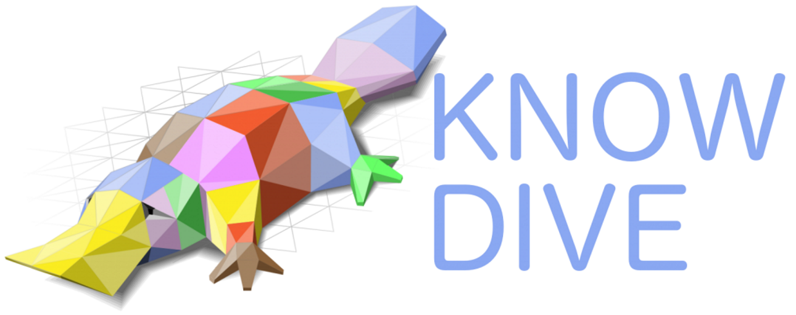

# KDI alignment | Trentino Transportation

> For more information about the `Knowledge and Data Integration` (KDI) course visit <https://unitn-kdi-2021.github.io/unitn-kdi-2021-website>

&nbsp;&nbsp;&nbsp;&nbsp;&nbsp;&nbsp;&nbsp;&nbsp;&nbsp;&nbsp;&nbsp;&nbsp;&nbsp;&nbsp;&nbsp;&nbsp;

## Members

|  Name  |  Surname  |     Username     |    MAT     |
| :----: | :-------: | :--------------: | :--------: |
| Carlo  | Corradini | `carlocorradini` | **223811** |
| Xuanli |    Li     |   `xuanli666`    | **220489** |

## Rust

> <https://www.rust-lang.org>

Rust is a multi-paradigm, general-purpose programming language designed for performance and safety, especially safe concurrency. Rust is syntactically similar to C++, but can guarantee memory safety by using a borrow checker to validate references. Rust achieves memory safety without garbage collection, and reference counting is optional. Rust has been called a systems programming language and in addition to high-level features such as functional programming it also offers mechanisms for low-level memory management.

Rust was originally designed by Graydon Hoare at Mozilla Research, with contributions from Dave Herman, Brendan Eich, and others. The designers refined the language while writing the Servo experimental browser engine, and the Rust compiler. It has gained increasing use in industry, and Microsoft has been experimenting with the language for secure and safety-critical software components.

Rust has been voted the "most loved programming language" in the Stack Overflow Developer Survey every year since 2016, though only used by 7% of the respondents in 2021.

### Install Rust

To install Rust on your machine (Linux, Windows or Mac) please visit <https://www.rust-lang.org/tools/install>.

## Compile

Compile the current package

> For more information visit <https://doc.rust-lang.org/cargo/commands/cargo-build.html>

```bash
cargo build --release
```

## Run

Run the current package

> For more information visit <https://doc.rust-lang.org/cargo/commands/cargo-run.html>

```bash
cargo run --release
```

After the `run` execution all the datasets that are present in the `data` directory are correctly aligned and saved under the `alignment` directory as [JSON](https://www.json.org) files.

## License

[MIT](./LICENSE)
